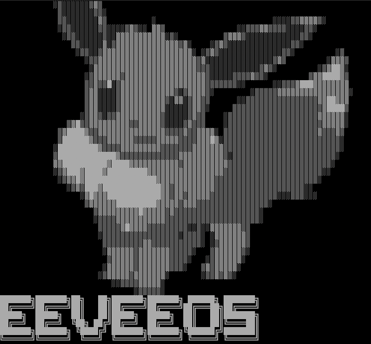

# EeveeOS

A WIP simple x86-64 monolithic kernel build upon the Limine boot protocol. Still in dev. Feel free to clone and poke around on your own!

## How to use this?

### Dependencies

Any `make` command depends on GNU make (`gmake`) and is expected to be run using it. This usually means using `make` on most GNU/Linux distros, or `gmake` on other non-GNU systems.

All `make all*` targets depend on a GNU-compatible C toolchain capable of generating x86-64 ELF objects. Usually `gcc/binutils` or `clang/llvm/lld` provided by any x86-64 UNIX like (including Linux) distribution will suffice.

Additionally, building an ISO with `make all` requires `xorriso`, and building a HDD/USB image with `make all-hdd` requires `sgdisk` (usually from `gdisk` or `gptfdisk` packages) and `mtools`.

### Makefile targets

Running `make all` will compile the kernel (from the `kernel/` directory) and then generate a bootable ISO image.

Running `make all-hdd` will compile the kernel and then generate a raw image suitable to be flashed onto a USB stick or hard drive/SSD.

Running `make run` will build the kernel and a bootable ISO (equivalent to make all) and then run it using `qemu` (if installed).

Running `make run-hdd` will build the kernel and a raw HDD image (equivalent to make all-hdd) and then run it using `qemu` (if installed).

The `run-uefi` and `run-hdd-uefi` targets are equivalent to their non `-uefi` counterparts except that they boot `qemu` using a UEFI-compatible firmware.
